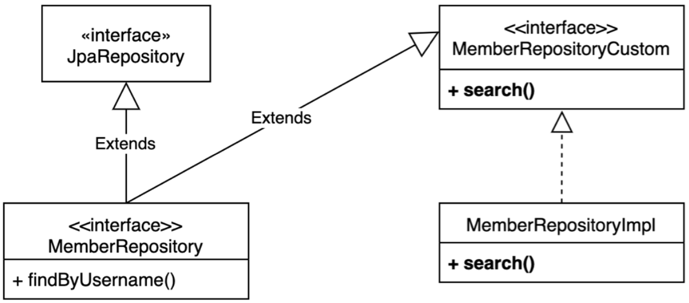

# 김영한님 "실전! Querydsl" 스터디

### Q타입

**Gradle IntelliJ 사용법**

- Gradle → Tasks → build → clean
- Gradle → Tasks → other → compileQuerydsl

**Gradle 콘솔 사용법**

- ./gradlew clean compileQuerydsl

**Q 타입 생성 확인**

- build → generated → querydsl
  - study.querydsl.entity.QHello.java 파일이 생성되어 있어야 함

> 참고: Q타입은 컴파일 시점에 자동 생성되므로 버전관리(GIT)에 포함하지 않는 것이 좋다. 앞서 설정에서 생성 위치를 gradle build 폴더 아래 생성되도록 했기 때문에 이 부분도 자연스럽게 해결된다. (대부분 gradle build 폴더를 git에 포함하지 않는다.)

### 기타 설정

참고: 모든 로그 출력은 가급적 로거를 통해 남겨야 한다.
> show_sql : 옵션은 System.out 에 하이버네이트 실행 SQL을 남긴다.
> org.hibernate.SQL : 옵션은 logger를 통해 하이버네이트 실행 SQL을 남긴다.

**쿼리 파라미터 로그 남기기**

- 로그에 다음을 추가하기 org.hibernate.type : SQL 실행 파라미터를 로그로 남긴다.
- 외부 라이브러리 사용
  [https://github.com/gavlyukovskiy/spring-boot-data-source-decorator](https://github.com/gavlyukovskiy/spring-boot-data-source-decorator)
  - implementation 'com.github.gavlyukovskiy:p6spy-spring-boot-starter:1.5.8’

### 시작

**Querydsl vs JPQL**

- EntityManager 로 JPAQueryFactory 생성
  - JPAQueryFactory queryFactory = new JPAQueryFactory(em);
- Querydsl은 JPQL 빌더
- JPQL: 문자(실행 시점 오류), Querydsl: 코드(컴파일 시점 오류)
- JPQL: 파라미터 바인딩 직접, Querydsl: 파라미터 바인딩 자동 처리

JPAQueryFactory

- JPAQueryFactory를 필드로 제공하면 동시성 문제는 어떻게 될까? 동시성 문제는 JPAQueryFactory를 생성할 때 제공하는 EntityManager(em)에 달려있다. 스프링 프레임워크는 여러 쓰레드에서 동시에 같은 EntityManager에 접근해도, 트랜잭션 마다 별도의 영속성 컨텍스트를 제공하기 때문에, 동시성 문제는 걱정하지 않아도 된다.

다음 설정을 추가하면 실행되는 JPQL을 볼 수 있다.

```yaml
spring.jpa.properties.hibernate.use_sql_comments: true
```

### **기본 Q-Type 활용**

**Q클래스 인스턴스를 사용하는 2가지 방법**

```java
// 같은 테이블을 조인해야 하는 경우가 아니면 기본 인스턴스를 사용하자
QMember qMember = new QMember("m"); // 별칭 직접 지정
QMember qMember = QMember.member; // 기본 인스턴스 사용
```

### **검색 조건 쿼리**

검색조건은 .and(), .or()를 메서드 체인으로 연결할 수 있다.

> 참고: select , from 을 selectFrom 으로 합칠 수 있음

where() 에 파라미터로 검색조건을 추가하면 AND 조건이 추가됨
이경우 null 값은 무시 → 메서드 추출을 활용해서 동적 쿼리를 깔끔하게 만들 수 있음

### **결과 조회**

- fetch() : 리스트 조회, 데이터 없으면 빈 리스트 반환
- fetchOne() : 단 건 조회
  - 결과가 없으면 : null
  - 결과가 둘 이상이면 : com.querydsl.core.NonUniqueResultException
- fetchFirst() : limit(1).fetchOne()
- fetchResults() : 페이징 정보 포함, total count 쿼리 추가 실행
- fetchCount() : count 쿼리로 변경해서 count 수 조회

### 정렬

- desc() , asc() : 일반 정렬
- nullsLast() , nullsFirst() : null 데이터 순서 부여

### 페이징

주의: count 쿼리가 실행되니 성능상 주의!

실무에서 페이징 쿼리를 작성할 때, 데이터를 조회하는 쿼리는 여러 테이블을 조인해야 하지만, count 쿼리는 조인이 필요 없는 경우도 있다. 그런데 이렇게 자동화된 count 쿼리는 원본 쿼리와 같이 모두 조인을 해버리기 때문에 성능이 안나올 수 있다. count 쿼리에 조인이 필요없는 성능 최적화가 필요하다면, count 전용 쿼리를 별도로 작성해야 한다.

```java
// given
Pageable pageable = PageRequest.of(0, 10);

// when
List<Member> content = queryFactory
        .selectFrom(member)
        .offset(pageable.getOffset())
        .limit(pageable.getPageSize())
        .fetch();

JPAQuery<Long> countQuery = queryFactory
        .select(member.count())
        .from(member);

Page<Member> page = PageableExecutionUtils.getPage(content, pageable, countQuery::fetchOne);
```

### **집합**

JPQL이 제공하는 모든 집합 함수를 제공한다.
tuple은 프로젝션과 결과반환에서 설명한다.

- 집합 함수
  - count(), sum(), avg(), max(), min()
- GroupBy 사용
  - groupBy(), having()

### 조인

조인의 기본 문법은 첫 번째 파라미터에 조인 대상을 지정하고, 두 번째 파라미터에 별칭(alias)으로 사용할 Q 타입을 지정하면 된다.

- join(조인 대상, 별칭으로 사용할 Q타입)
  - `.join(QMember.member.team, QTeam.team)`
  - join() , innerJoin() : 내부 조인(inner join)
  - leftJoin() : left 외부 조인(left outer join)
  - rightJoin() : rigth 외부 조인(rigth outer join)
  - JPQL의 on과 성능 최적화를 위한 fetch 조인 제공

  ```java
  List<Member> result = queryFactory
          .selectFrom(member)
          .join(member.team, team)
          .where(team.name.eq("teamA"))
          .fetch();
  ```

- **세타 조인**
  - 연관관계가 없는 필드로 조인
  - from 절에 여러 엔티티를 선택해서 세타 조인
    - `.from(member, team).where(member.username.eq(team.name))`
  - 외부 조인 불가능 → 다음에 설명할 조인 on을 사용하면 외부 조인 가능

  ```java
  List<Member> result = queryFactory
          .select(member)
          .from(member, team)
          .where(member.username.eq(team.name))
          .fetch();
  ```

- on절(JPA 2.1부터 지원)
  1. 조인 대상 필터링
    1. 참고: on 절을 활용해 조인 대상을 필터링 할 때, 외부조인이 아니라 내부조인(inner join)을 사용하면, where 절에서 필터링 하는 것과 기능이 동일하다. 따라서 on 절을 활용한 조인 대상 필터링을 사용할 때, 내부조인 이면 익숙한 where 절로 해결하고, 정말 외부조인이 필요한 경우에만 이 기능을 사용하자.
  2. 연관관계 없는 엔티티 외부 조인
    1. 하이버네이트 5.1부터 on 을 사용해서 서로 관계가 없는 필드로 외부 조인하는 기능이 추가되었다. 물론 내부 조인도 가능하다.
    2. 주의! 문법을 잘 봐야 한다. **leftJoin()** 부분에 일반 조인과 다르게 엔티티 하나만 들어간다.
      1. 일반조인: leftJoin(member.team, team)
        1. on member.team_id = team.team_id 를 작성해준다.
      2. on조인: from(member).leftJoin(team).on(xxx)
        1. on xxx 만 작성된다.

    ```java
    List<Tuple> result = queryFactory
            .select(member, team)
            .from(member)
            .leftJoin(team).on(member.username.eq(team.name))
            .fetch();
    ```

- 페치 조인

  페치 조인은 SQL에서 제공하는 기능은 아니다. SQL조인을 활용해서 연관된 엔티티를 SQL 한번에 조회하는 기능이다. 주로 성능 최적화에 사용하는 방법이다.

  join(), leftJoin() 등 조인 기능 뒤에 fetchJoin() 이라고 추가하면 된다.

  ```java
  Member findMember = queryFactory
          .selectFrom(member)
          .join(member.team, team).fetchJoin()
          .where(member.username.eq("member1"))
          .fetchOne();
  ```


### 서브 쿼리

com.querydsl.jpa.JPAExpressions 사용

where 절에 **subquery 가능**

```java
QMember memberSub = new QMember("memberSub");

List<Member> result = queryFactory
        .selectFrom(member)
        .where(member.age.in(
                JPAExpressions
                        .select(memberSub.age)
                        .from(memberSub)
                        .where(memberSub.age.gt(10))
        )).fetch();
```

**from 절의 서브쿼리 한계**

JPA JPQL 서브쿼리의 한계점으로 from 절의 서브쿼리(인라인 뷰)는 지원하지 않는다. 당연히 Querydsl 도 지원하지 않는다. 하이버네이트 구현체를 사용하면 select 절의 서브쿼리는 지원한다. Querydsl도 하이버네이트 구현체를 사용하면 select 절의 서브쿼리를 지원한다.

**from 절의 서브쿼리 해결방안**

1. 서브쿼리를 join으로 변경한다. (가능한 상황도 있고, 불가능한 상황도 있다.)
2. 애플리케이션에서 쿼리를 2번 분리해서 실행한다.
3. nativeSQL을 사용한다.

### **Case 문**

**select, 조건절(where), order by에서 사용 가능**

```java
// 단순한 조건
List<String> result = queryFactory
        .select(member.age
                .when(10).then("열살")
                .when(20).then("스무살")
                .otherwise("기타")) 
        .from(member)
        .fetch();

// 복잡한 조건
List<String> result = queryFactory
        .select(new CaseBuilder()
                .when(member.age.between(0, 20)).then("0~20살") 
                .when(member.age.between(21, 30)).then("21~30살") 
                .otherwise("기타"))
        .from(member)
        .fetch();

// orderBy에서 Case 문
NumberExpression<Integer> rankPath = new CaseBuilder()
        .when(member.age.between(0, 20)).then(2)
        .when(member.age.between(21, 30)).then(1)
        .otherwise(3);

List<Tuple> result = queryFactory
        .select(member.username, member.age, rankPath)
        .from(member)
        .orderBy(rankPath.desc())
        .fetch();
```

### **상수, 문자 더하기**

- 상수가 필요하면 Expressions.constant(xxx) 사용
- concat(a, b)
  - `member.username.concat("_").concat(member.age.stringValue())`
  - 참고: member.age.stringValue() 부분이 중요한데, 문자가 아닌 다른 타입들은 stringValue() 로
    문자로 변환할 수 있다. 이 방법은 ENUM을 처리할 때도 자주 사용한다.

## **중급 문법**

### **프로젝션과 결과 반환 - 기본**

프로젝션: select 대상 지정

- **프로젝션 대상이 하나**
  - 프로젝션 대상이 하나면 타입을 명확하게 지정할 수 있음
  - 프로젝션 대상이 둘 이상이면 튜플이나 DTO로 조회
- **튜플 조회**
  - 프로젝션 대상이 둘 이상일 때 사용
  - querydsl 에 종속적인 타입이므로 서비스 밖으로 던지지 말자. DTO를 사용하자.
- **DTO 조회**
  - **Querydsl 빈 생성(Bean population)**
    - 프로퍼티 접근**- Setter**
      - Projections.bean(MemberDto.class, member.username, …)
    - 필드 직접 접근
      - Projections.fields(MemberDto.class, member.username, …)
      - 프로퍼티나, 필드 접근 생성 방식에서 이름이 다를 때 해결 방안
        [ExpressionUtils.as](http://expressionutils.as/)(source, alias) : 필드나, 서브 쿼리에 별칭 적용 [username.as](http://username.as/)("memberName") : 필드에 별칭 적용
    - 생성자 사용
      - Projections.constructor(MemberDto.class, member.username, …)
- **프로젝션과 결과 반환 - @QueryProjection**
  - 생성자 + @QueryProjection

    ```java
    public class MemberDto {
        ...
    
        @QueryProjection
        public MemberDto(String username, int age) {
            this.username = username;
            this.age = age;
        }
    
        ....
    }
    ```

    - ./gradlew compileQuerydsl → QMemberDto 생성 확인

    ```java
    List<MemberDto> result = queryFactory
            .select(new QMemberDto(member.username, member.age))
            .from(member)
            .fetch();
    ```

  - 이 방법은 컴파일러로 타입을 체크할 수 있으므로 가장 안전한 방법이다.
  - 다만 DTO에 QueryDSL 어노테이션을 유지해야 하는 점과 DTO까지 Q 파일을 생성해야 하는 단점이 있다.
- distinct
  - distinct는 JPQL의 distinct와 같다.
  - List<String> result = select().distinct().from().fetch();

### **동적 쿼리**

- BooleanBuilder

  ```java
  BooleanBuilder builder = new BooleanBuilder();
  if (usernameCond != null) {
      builder.and(member.username.eq(usernameCond));
  }
  
  return queryFactory
          .selectFrom(member)
          .where(builder)
          .fetch();
  ```

- Where 다중 파라미터 사용

  ```java
  public List<Member> searchMember2(String usernameCond, Integer ageCond) {
      return queryFactory
              .selectFrom(member)
              .where(usernameEq(usernameCond), ageEq(ageCond))
              .fetch();
  }
  
  private BooleanExpression usernameEq(String usernameCond) {
      return usernameCond != null ? member.username.eq(usernameCond) : null;
  }
  private BooleanExpression ageEq(Integer ageCond) {
      return ageCond != null ? member.age.eq(ageCond) : null;
  }
  // 조합 & 재사용
  private BooleanExpression usernameEqAndAgeEq(String usernameCond, Integer ageCond) {
      BooleanExpression usernameExpression = usernameEq(usernameCond);
      BooleanExpression ageExpression = ageEq(ageCond);
      if (usernameExpression != null) {
          return usernameExpression.and(ageExpression);
      }
      return ageExpression;
  }
  ```

  - where 조건에 null 값은 무시된다.
  - 메서드를 다른 쿼리에서도 재활용 할 수 있다.
  - 쿼리 자체의 가독성이 높아진다.

### **수정, 삭제 벌크 연산**

**쿼리 한번으로 대량 데이터 수정, 삭제**

```java
long count = queryFactory
        .update(member)
        .set(member.age, member.age.add(1))
        .where(member.age.lt(28))
        .execute();

long count = queryFactory
        .delete(member)
        .where(member.age.gt(18))
        .execute();
```

JPQL 배치와 마찬가지로, 영속성 컨텍스트에 있는 엔티티를 무시하고 실행되기 때문에 배치 쿼리를 실행하고 나면 영속성 컨텍스트를 초기화 하는 것이 안전하다.

### **SQL function 호출하기**

SQL function은 JPA와 같이 Dialect에 등록된 내용만 호출할 수 있다.

```java
Expressions.stringTemplate(
        "function('replace', {0}, {1}, {2})",
        member.username,
        "member",
        "M")

// 함수 사용
member.username.eq(Expressions.stringTemplate("function('lower', {0})", member.username))

// querydsl 기능 사용
member.username.eq(member.username.lower())
```

### **JPAQueryFactory 스프링 빈 등록**

```java
@Bean
JPAQueryFactory jpaQueryFactory(EntityManager em) {
    return new JPAQueryFactory(em);
}
```

- 참고: 동시성 문제는 걱정하지 않아도 된다. 왜냐하면 여기서 스프링이 주입해주는 엔티티 매니저는 실제
  동작 시점에 진짜 엔티티 매니저를 찾아주는 프록시용 가짜 엔티티 매니저이다. 이 가짜 엔티티 매니저는
  실제 사용 시점에 트랜잭션 단위로 실제 엔티티 매니저(영속성 컨텍스트)를 할당해준다.

### **사용자 정의 리포지토리**

**사용자 정의 리포지토리 사용법**

1. 사용자 정의 인터페이스 작성
2. 사용자 정의 인터페이스 구현
3. 스프링 데이터 리포지토리에 사용자 정의 인터페이스 상속



### **스프링 데이터 페이징 활용1 - Querydsl 페이징 연동**

- **전체 카운트를 한번에 조회하는 단순한 방법**
  - **fetchResults() 사용**
  - ~~Querydsl이 제공하는 fetchResults() 를 사용하면 내용과 전체 카운트를 한번에 조회할 수 있다.(실제 쿼리는 2번 호출)
    fetchResult() 는 카운트 쿼리 실행시 필요없는 order by 는 제거한다.~~
  - **deprecated**
- **데이터 내용과 전체 카운트를 별도로 조회하는 방법**
  - return new PageImpl<>(List<Dto> data, Pageable pageable, long totalCount);
  - 전체 카운트를 조회 하는 방법을 최적화 할 수 있으면 이렇게 분리하면 된다. (예를 들어서 전체 카운트를 조회할 때 조인 쿼리를 줄일 수 있다면 상당한 효과가 있다.)
  - 코드를 리펙토링해서 내용 쿼리과 전체 카운트 쿼리를 읽기 좋게 분리하면 좋다.

### **스프링 데이터 페이징 활용2 - CountQuery 최적화**

**PageableExecutionUtils.getPage()로 최적화**

- 스프링 데이터 라이브러리가 제공
  - org.springframework.data.support.PageableExecutionUtils
- count 쿼리가 생략 가능한 경우 생략해서 처리
  - 페이지 시작이면서 컨텐츠 사이즈가 페이지 사이즈보다 작을 때
  - 마지막 페이지 일 때 (offset + 컨텐츠 사이즈를 더해서 전체 사이즈 구함)

```java
import org.springframework.data.support.PageableExecutionUtils; //패키지 변경

public Page<MemberTeamDto> searchPageComplex(MemberSearchCondition condition,
                       Pageable pageable) {
    List<MemberTeamDto> content = queryFactory
            .select(new QMemberTeamDto(
                    member.id.as("memberId"),
                    member.username,
                    member.age,
                    team.id.as("teamId"),
                    team.name.as("teamName")))
            .from(member)
            .leftJoin(member.team, team)
            .where(
                    usernameEq(condition.getUsername()),
                    teamNameEq(condition.getTeamName()),
                    ageGoe(condition.getAgeGoe()),
                    ageLoe(condition.getAgeLoe())
            )
            .offset(pageable.getOffset())
            .limit(pageable.getPageSize())
            .fetch();
    
    JPAQuery<Long> countQuery = queryFactory
            .select(member.count())
            .from(member)
            .leftJoin(member.team, team)
            .where(
                    usernameEq(condition.getUsername()),
                    teamNameEq(condition.getTeamName()),
                    ageGoe(condition.getAgeGoe()),
                    ageLoe(condition.getAgeLoe())
            );
    
    return PageableExecutionUtils.getPage(content, pageable, countQuery::fetchOne);
}
```

### **스프링 데이터 정렬(Sort)**

**스프링 데이터 Sort를 Querydsl의 OrderSpecifier로 변환**

```java
JPAQuery<Member> query = queryFactory.selectFrom(member);

for (Sort.Order o : pageable.getSort()) {
    PathBuilder pathBuilder = new PathBuilder(member.getType(), member.getMetadata());
    query.orderBy(new OrderSpecifier(o.isAscending() ? Order.ASC : Order.DESC,
            pathBuilder.get(o.getProperty())));
}
List<Member> result = query.fetch();
```

참고: 정렬( Sort )은 조건이 조금만 복잡해져도 Pageable 의 Sort 기능을 사용하기 어렵다. 루트 엔티티 범위를 넘어가는 동적 정렬 기능이 필요하면 스프링 데이터 페이징이 제공하는 Sort 를 사용하기 보다는 파라미터를 받아서 직접 처리하는 것을 권장한다.

### **스프링 데이터 JPA가 제공하는 Querydsl 기능**

여기서 소개하는 기능은 제약이 커서 복잡한 실무 환경에서 사용하기에는 많이 부족하다. 그래도 스프링
데이터에서 제공하는 기능이므로 간단히 소개하고, 왜 부족한지 설명하겠다.

- **인터페이스 지원 - QuerydslPredicateExecutor**
  공식 URL: [https://docs.spring.io/spring-data/jpa/docs/2.2.3.RELEASE/reference/html/#core.extensions.querydsl](https://docs.spring.io/spring-data/jpa/docs/2.2.3.RELEASE/reference/html/#core.extensions.querydsl)

  ```java
  interface MemberRepository extends JpaRepository<Member, Long>, 
      QuerydslPredicateExecutor<Member> {
  }
  
  Iterable result = memberRepository.findAll(
      member.age.between(10, 40).and(member.username.eq("member1"))
  );
  ```

  **한계점**

  조인X (묵시적 조인은 가능하지만 left join이 불가능하다.)
  클라이언트가 Querydsl에 의존해야 한다. 서비스 클래스가 Querydsl이라는 구현 기술에 의존해야 한다.
  복잡한 실무환경에서 사용하기에는 한계가 명확하다.

  참고: QuerydslPredicateExecutor 는 Pagable, Sort를 모두 지원하고 정상 동작한다.

- **Querydsl Web 지원**

  공식 URL: [https://docs.spring.io/spring-data/jpa/docs/2.2.3.RELEASE/reference/html/#core.web.type-safe](https://docs.spring.io/spring-data/jpa/docs/2.2.3.RELEASE/reference/html/#core.web.type-safe)

  **한계점**

  단순한 조건만 가능
  조건을 커스텀하는 기능이 복잡하고 명시적이지 않음
  컨트롤러가 Querydsl에 의존
  복잡한 실무환경에서 사용하기에는 한계가 명확

- **리포지토리 지원 - QuerydslRepositorySupport**

**장점**

getQuerydsl().applyPagination() 스프링 데이터가 제공하는 페이징을 Querydsl로 편리하게 변환
가능(단! Sort는 오류발생)
from() 으로 시작 가능(최근에는 QueryFactory를 사용해서 select() 로 시작하는 것이 더 명시적)
EntityManager 제공

**한계**

Querydsl 3.x 버전을 대상으로 만듬
Querydsl 4.x에 나온 JPAQueryFactory로 시작할 수 없음
select로 시작할 수 없음 (from으로 시작해야함)
QueryFactory 를 제공하지 않음
스프링 데이터 Sort 기능이 정상 동작하지 않음

### **Querydsl 지원 클래스 직접 만들기**

스프링 데이터가 제공하는 QuerydslRepositorySupport 가 지닌 한계를 극복하기 위해 직접 Querydsl 지원 클래스를 만들어보자.

**장점**

- 스프링 데이터가 제공하는 페이징을 편리하게 변환
- 페이징과 카운트 쿼리 분리 가능
- 스프링 데이터 Sort 지원
- select() , selectFrom() 으로 시작 가능
- EntityManager , QueryFactory 제공
